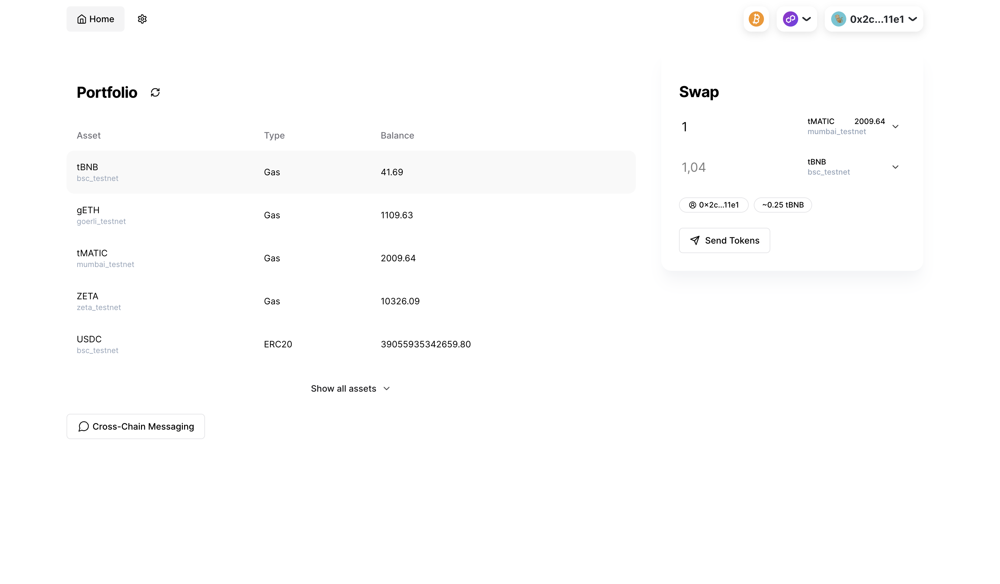

# ZetaChain Frontend App Template

This repository provides a frontend app template for developers looking to build
applications on ZetaChain. It's designed to demonstrate various ZetaChain
functionalities and serve as a starting point for custom DApp development.



The template is built with [Next.js](https://nextjs.org/),
[Tailwind](https://tailwindcss.com/), [shadcn/ui](https://ui.shadcn.com/), and
the [ZetaChain Toolkit](https://github.com/zeta-chain/toolkit/).

## Features

- Portfolio view with token balances
- Omnichain swaps
- Token deposit and withdrawal
- Cross-chain transaction tracking
- Cross-chain messaging example
- Bitcoin support

## Prerequisites

- Node.js v18
- Yarn

## Getting Started

Start a development server:

```
yarn dev
```

## Contributions

Contributions are welcome. Please fork the project, create your feature branch,
commit your changes, push to the branch, and open a pull request.

## Disclaimer

This is an early stage project. Expect bugs, breaking changes, and unfinished
features. Please use at your own risk.
